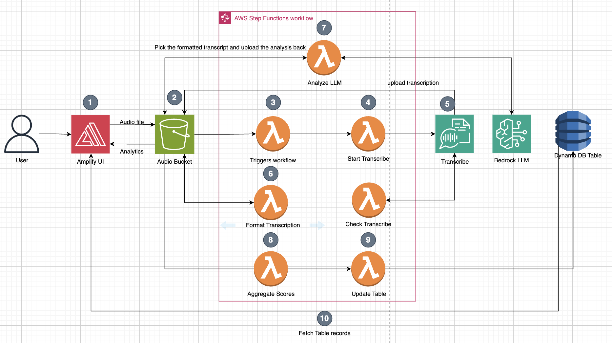

# Boys Town Hotline QA Analysis Pipeline

A comprehensive, enterprise-grade automated quality assessment system for Boys Town's National Hotline call recordings. This solution leverages AWS serverless architecture and advanced AI services to provide consistent, scalable, and actionable quality evaluations for counselor training and performance improvement.

## Architecture Overview



### Core AWS Services
- **Amazon S3**: Secure storage for recordings, transcripts, and analysis results
- **AWS Transcribe Call Analytics**: Advanced speech-to-text with speaker separation and call insights
- **Amazon Bedrock (Nova Pro)**: AI-powered quality assessment against Boys Town's QA rubric
- **AWS Step Functions**: Orchestrates the complete processing workflow
- **AWS Lambda**: 13 specialized functions handling different processing stages
- **Amazon DynamoDB**: Stores counselor evaluations and profile data with indexing
- **Amazon API Gateway**: RESTful API for frontend integration
- **AWS Amplify**: Hosts React frontend with automated CI/CD
- **AWS CodeBuild**: Automated deployment system

### System Architecture
```
Audio Upload (S3) → Step Functions Workflow → Transcribe → Format → AI Analysis → Score Aggregation → DynamoDB Storage → Frontend Display
```

## Key Features

### Automated Quality Assessment
- **AI-Powered Analysis**: Uses Amazon Nova Pro for consistent evaluation against Boys Town's specific QA rubric
- **Multi-Category Scoring**: Evaluates Rapport Skills, Counseling Skills, Crisis Intervention, and more
- **Actionable Insights**: Provides specific feedback for counselor training and improvement
- **Consistent Standards**: Eliminates human bias and ensures uniform evaluation criteria

### Comprehensive Counselor Management
- **Individual Tracking**: Links evaluations to counselors via filename pattern (`FirstName_LastName_ID.wav`)
- **Performance Trends**: Historical analysis of counselor performance over time
- **Program-Based Organization**: Groups counselors by program type for targeted analysis
- **Profile Management**: Complete CRUD operations for counselor data and assignments

### Intelligent Workflow Orchestration
- **Event-Driven Processing**: Automatic workflow initiation on file upload
- **Status Monitoring**: Real-time tracking of processing stages
- **Error Handling**: Robust retry logic and failure notifications
- **Scalable Processing**: Handles multiple concurrent evaluations

### Modern Web Interface
- **React Frontend**: Intuitive interface for uploading files and viewing results
- **Real-Time Updates**: Live status tracking of processing workflows
- **Data Visualization**: Charts and graphs for performance analysis
- **Responsive Design**: Works seamlessly across desktop and mobile devices

## Data Organization

### S3 Bucket Structure
```
your-bucket-name/
├── records/                    # Upload audio files here (.wav format)
├── transcripts/
│   ├── analytics/             # Full Transcribe Call Analytics output
│   └── formatted/             # Simplified transcript format
└── results/
    ├── llmOutput/             # Raw AI analysis results
    └── aggregated/            # Final scores and evaluations
```

### Database Schema

#### Counselor Evaluations Table
- **Primary Key**: CounselorId (Partition) + EvaluationId (Sort)
- **Global Secondary Index**: EvaluationDateIndex for time-based queries
- **Attributes**: Scores, percentages, criteria ratings, S3 result links

#### Counselor Profiles Table
- **Primary Key**: CounselorId
- **Global Secondary Index**: ProgramTypeIndex for program-based queries
- **Attributes**: Personal info, program assignments, contact details

## Deployment Using AWS CodeBuild and AWS CloudShell

### Prerequisites
- Have access to CodeBuild and AWS CloudShell

- Fork this repository to your own GitHub account (required for deployment and CI/CD):
  1. Navigate to [https://github.com/ASUCICREPO/Boys-Town-Hotline-QA](https://github.com/ASUCICREPO/Boys-Town-Hotline-QA)
  2. Click the "Fork" button in the top right corner
  3. Select your GitHub account as the destination
  4. Wait for the forking process to complete
  5. You'll now have your own copy at https://github.com/YOUR-USERNAME/Boys-Town-Hotline-QA

- GitHub Personal Access Token with repo permissions:
  1. Go to GitHub Settings > Developer Settings > Personal Access Tokens > Tokens (classic)
  2. Click "Generate new token (classic)"
  3. Give the token a name and select the "repo" and "admin:repo_hook" scope
  4. Click "Generate token" and save the token securely
  For detailed instructions, see:
  - https://docs.github.com/en/authentication/keeping-your-account-and-data-secure/managing-your-personal-access-tokens

- Enable Nova Pro access in AWS Bedrock models in your AWS account in **us-east-1**:
  1. Navigate to the AWS Bedrock console
  2. Click "Model access" in the left navigation pane
  3. Click "Manage model access."
  4. Find each model in the list and select the checkbox next to it
  5. Click "Save changes" at the bottom of the page
  6. Wait for model access to be granted (usually within minutes)
  7. Verify access by checking the "Status" column shows "Access granted"

### Deployment

1. **Open AWS CloudShell in your AWS Console:**
   - Click the CloudShell icon in the AWS Console navigation bar
   - Wait for the CloudShell environment to initialize

2. **Clone the repository** (Make sure to have your own forked copy of the repo and replace the link with the forked repository link):
   ```bash
   git clone https://github.com/<YOUR-USERNAME>/Boys-Town-Hotline-QA
   cd Boys-Town-Hotline-QA/
   ```

3. **Deploy using the deployment script** (recommended): The script will prompt you for variables needed for deployment.
   ```bash
   chmod +x deploy.sh
   ./deploy.sh
   ```

4. **Follow the interactive prompts:**
   - Enter your forked GitHub repository URL
   - Provide a unique company/project name for resource naming
   - Enter your GitHub Personal Access Token
   - Confirm deployment

5. **Wait for deployment completion** (10-15 minutes)

6. **Access your deployed system** using the URLs provided in the output

## API Reference

### Authentication
All API endpoints are publicly accessible. In production, consider adding authentication via API Gateway authorizers.

### Endpoints

#### File Management
- `POST /generate-url` - Generate S3 presigned URLs for file uploads
- `GET /get-results?fileName={name}` - Get analysis results by filename
- `GET /execution-status?fileName={name}` - Check processing status

#### Analysis Results
- `GET /analysis/{fileId}` - Get specific analysis results
- `GET /get-data` - Get all counselor evaluation data

#### Counselor Management
- `GET /profiles` - List all counselor profiles
- `POST /profiles` - Create new counselor profile
- `GET /profiles/{counselorId}` - Get specific counselor profile
- `PUT /profiles/{counselorId}` - Update counselor profile
- `DELETE /profiles/{counselorId}` - Delete counselor profile

## Monitoring and Observability

### CloudWatch Integration
- **Lambda Metrics**: Function duration, error rates, and invocation counts
- **Step Functions**: Workflow execution tracking and failure analysis
- **API Gateway**: Request/response logging and performance metrics
- **Custom Dashboards**: Real-time system health monitoring

## Troubleshooting

### Common Issues

**AWS CLI Not Configured**
```bash
aws configure
# Or use AWS CloudShell
```

**Insufficient Permissions**
Ensure your AWS user has:
- CloudFormation full access
- IAM full access  
- Service creation permissions (S3, Lambda, etc.)

**GitHub Token Issues**
- Verify token has correct permissions
- Check token hasn't expired
- Ensure repository is accessible

**Build Failures**
- Check CodeBuild logs in AWS Console
- Verify all parameters are correct
- Ensure GitHub repository is accessible

### Getting Help

1. **Check Build Logs**: AWS CodeBuild console shows detailed logs
2. **CloudFormation Events**: See what resources are being created/failed
3. **GitHub Issues**: Report problems in the repository

## Security Notes

- GitHub tokens are stored securely in AWS Secrets Manager
- IAM roles follow least-privilege principles
- All resources are created in your AWS account
- No external access to your data

## Contributing

1. Fork the repository
2. Create a feature branch: `git checkout -b feature/new-feature`
3. Commit changes: `git commit -am 'Add new feature'`
4. Push to branch: `git push origin feature/new-feature`
5. Submit a Pull Request

## Support

For technical support or questions:
- Create an issue in the GitHub repository
- Check the troubleshooting section above
- Review AWS CloudWatch logs for detailed error information

---